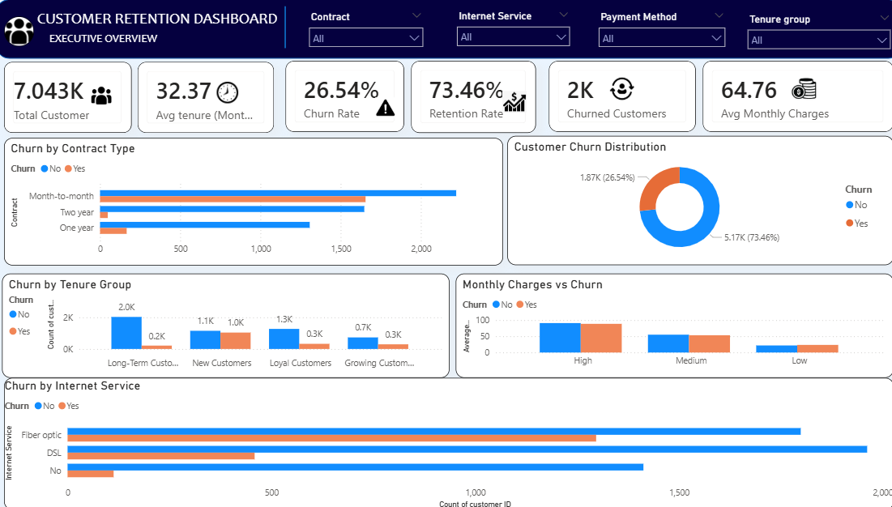
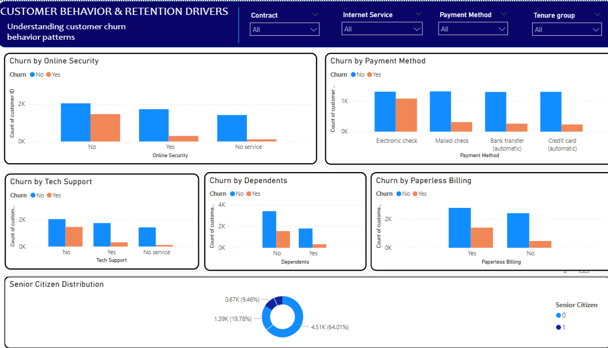
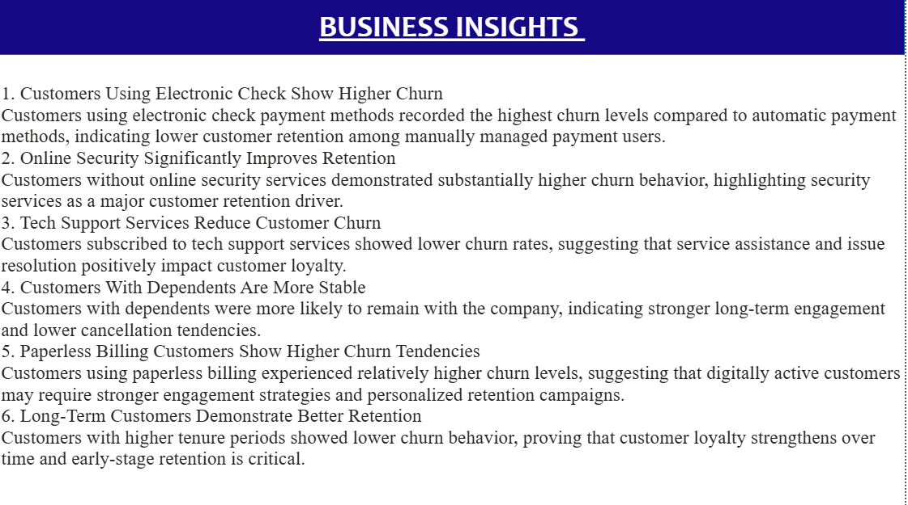
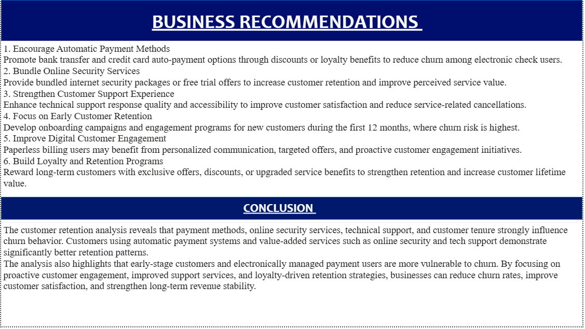

# FUTURE_DS_02

# Customer Retention & Churn Analysis Dashboard

## Project Overview

This project analyzes customer churn behavior and retention patterns using Excel and Power BI. The objective of this analysis is to identify major churn drivers, understand customer behavior, and provide actionable business recommendations to improve customer retention.

---

## Tools Used

- Microsoft Excel
- Power BI

---

## KPIs Analyzed

- Total Customers
- Churned Customers
- Churn Rate
- Retention Rate
- Average Tenure
- Average Monthly Charges

---

# Dashboard Pages

## Page 1 – Executive Overview

This page provides a high-level overview of customer retention performance and churn metrics.

### Key Visuals
- Churn by Contract Type
- Churn Distribution
- Churn by Tenure Group
- Monthly Charges vs Churn
- Churn by Internet Service

### Dashboard Preview

---

## Page 2 – Customer Behavior & Retention Drivers

This page focuses on identifying major behavioral and service-related churn factors.

### Key Visuals
- Churn by Online Security
- Churn by Payment Method
- Churn by Tech Support
- Churn by Dependents
- Churn by Paperless Billing
- Senior Citizen Distribution

### Dashboard Preview

---

## Page 3 – Business Insights

### Key Insights

1. Customers using electronic check payment methods recorded the highest churn levels.
2. Online security and tech support services significantly improve customer retention.
3. Customers with dependents show greater retention stability.
4. Paperless billing customers demonstrate relatively higher churn tendencies.
5. Long-term customers show lower churn behavior.

### Insights Preview

---

## Page 4 – Recommendations & Conclusion

### Business Recommendations

1. Encourage automatic payment methods.
2. Improve online security adoption.
3. Strengthen customer support services.
4. Focus on onboarding and early retention strategies.
5. Develop customer loyalty programs.

### Conclusion

The analysis reveals that payment methods, online security services, customer support, and tenure significantly influence customer churn behavior. Businesses can improve retention by enhancing engagement strategies, improving service quality, and strengthening customer loyalty initiatives.

### Recommendations Preview

---

## Files Included

- Power BI Dashboard (.pbix)
- Cleaned Excel Dataset
- Dashboard Screenshots
- Dashboard Walkthrough Video

---

## Skills Demonstrated

- Data Cleaning
- Churn Analysis
- KPI Development
- Dashboard Design
- Business Intelligence
- Data Visualization
- Data Storytelling

---

## Author

PAMPATI VIGNESH
